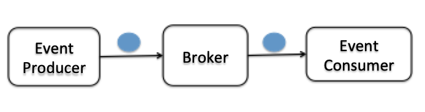

# Use `Broker` and `Trigger` to manage events and subscriptions

If we want to hide the details of event routing from the event producer and event consumer, we can use `Broker` and `Trigger` to manage events and subscriptions. An event producer can send events to `Broker` without any knowledge of event consumers. An event consumer can register its interests to events by `Trigger` without any knowledge of event producers. Events will be routed to any subscribers who are interested in that event by Knative Eventing platform.



In this lab, we create a heart beats event importer, specifing a default broker as the `SINK`. Events emitted from the event producer will be sent to the default broker. And then we define a `Trigger` to subscribe a Knative service to all events in default broker.

## 1. Create a default `Broker`

A Broker represents an ‘event mesh’. The easiest way to create a Broker is to annotate your namespace by:

```text
kubectl label namespace default knative-eventing-injection=enabled
```

Expected output:
```
namespace/default labeled
```

Check if the broker has been created by:
```text
kubectl get broker
```

Expected output:
```
NAME      READY     REASON    HOSTNAME                                   AGE
default   True                default-broker.default.svc.cluster.local   14s
```

Please notice the status `READY` of broker is `True`.

Now you can check the running pods serving for brokers by below command line:
```
kubectl get pods
```

Expected output:
```
NAME                                              READY   STATUS    RESTARTS   AGE
default-broker-filter-798df8bc75-77m2r            1/1     Running   0          43s
default-broker-ingress-5fbb869648-q4xzb           1/1     Running   0          43s
```
The pod `default-broker-ingress-*` is responsible for receiving events; the pod `default-broker-filter-*` is responsible for forwarding events to interested targets.

## 2. Create a heart beats event source

ContainerSource is predefined event source which will keep a single Pod running with the specified image, environment, and arguments as an event producer. Now we use ContainerSource to create a heart beats event source, producing events at the specified interval. The image URI of this event source is `docker.io/daisyycguo/heartbeats-6790335e994243a8d3f53b967cdd6398`.

Look at the content of `heartbeats.yaml`, which describes the configuration of a heart beats event source:

```text
cat heartbeats.yaml
```

Expected output:
```
apiVersion: sources.eventing.knative.dev/v1alpha1
kind: ContainerSource
metadata:
  name: heartbeats-sender
spec:
  image: docker.io/daisyycguo/heartbeats-6790335e994243a8d3f53b967cdd6398
  sink:
    apiVersion: eventing.knative.dev/v1alpha1
    kind: Broker
    name: default
  args:
    - --period=1
  env:
    - name: POD_NAME
      value: "heartbeats"
    - name: POD_NAMESPACE
      value: "default"
```

There are four parameters in the `spec` of a ContainerSource:
- image: the image URL that running inside the event source pod.
- args and env: environment and arguments to the running container.
- sink: the URI events will be forwarded on to. Here we use the created default broker.

Create a ContainerSource `heartbeats-sender` by running:
```text
kubectl apply -f heartbeats.yaml
```

Expected output:
```
containersource.sources.eventing.knative.dev/heartbeats-sender created
```

Check if `heartbeats-sender` has been created by:
```text
kubectl get ContainerSource
```

Expected output:
```
NAME                AGE
heartbeats-sender   2m
```

## 3. Create a Trigger to add a subscriber to default broker

A Trigger represents a desire to subscribe to events from a specific Broker. We create a Trigger to have Knative service `event-display` to subscribe to the events sent to default Broker.

Look at the content of `trigger1.yaml`, which describe a definition of a Trigger:
```text
cat trigger1.yaml
```

Expected output:
```
apiVersion: eventing.knative.dev/v1alpha1
kind: Trigger
metadata:
  name: mytrigger
spec:
  subscriber:
    ref:
      apiVersion: serving.knative.dev/v1alpha1
      kind: Service
      name: event-display
```

You can see a `subscriber` is defined in its `spec`, which refer to a Knative service `event-display`:

Run below command to create a Trigger `mytrigger`:
```text
kubectl apply -f trigger1.yaml
```

Expected output:
```
trigger.eventing.knative.dev/mytrigger created
```

Check if Trigger has been created:
```text
kubectl get trigger
```

Expected output:
```
NAME        READY     REASON    BROKER    SUBSCRIBER_URI                                    AGE
mytrigger   True                default   http://event-display.default.svc.cluster.local/   29s
```

## 4. Look at the logs of event-display

List running Pods and see if the pod `event-display-*` is running: 
```
kubectl get pods
```

Expected output:
```
NAME                                              READY   STATUS    RESTARTS   AGE
default-broker-filter-798df8bc75-77m2r            1/1     Running   0          4m32s
default-broker-ingress-5fbb869648-q4xzb           1/1     Running   0          4m32s
event-display-46hhp-deployment-597487d855-dm77n   2/2     Running   0          19s
heartbeats-sender-dhnz8-569967d749-8wbwt          1/1     Running   0          3m36s
```

Check the log of `event-display`:
```
kubectl logs -f $(kubectl get pods --selector=serving.knative.dev/configuration=event-display --output=jsonpath="{.items..metadata.name}") user-container
```

You can see the events in CloudEvent format as below：
```
_  CloudEvent: valid _
Context Attributes,
  SpecVersion: 0.2
  Type: dev.knative.eventing.samples.heartbeat
  Source: https://github.com/knative/eventing-sources/cmd/heartbeats/#default/heartbeats
  ID: 5fff8cd4-96c5-4fd6-b116-2a96977791e2
  Time: 2019-06-20T16:04:08.921707135Z
  ContentType: application/json
  Extensions:
    beats: true
    heart: yes
    knativehistory: default-broker-tp97m-channel-znkp9.default.svc.cluster.local
    the: 42
Transport Context,
  URI: /
  Host: event-display.default.svc.cluster.local
  Method: POST
Data,
  {
    "id": 26,
    "label": ""
  }
```

The events from heart beat event source have been printed to logs. It demostrated that the event source `heartbeats-sender` sent the events to Broker, and Broker forwards to `event-display`.

Terminate the process by `ctrl + c`.


