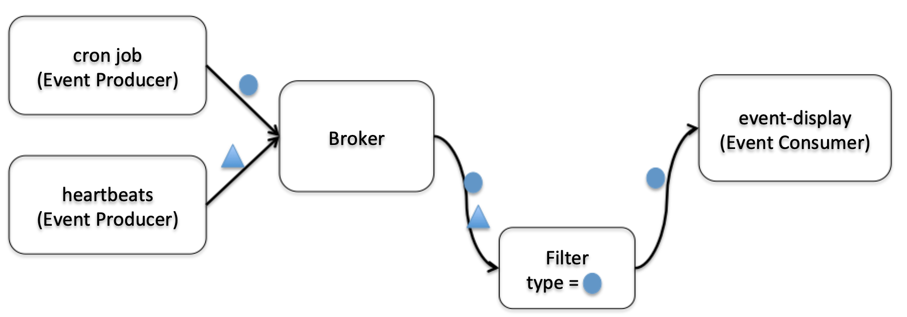

# Define a Filter

Multiple kinds of events can be sent to the same broker. If you are interested in a specific type of events, you can use the Filter configuration option in the Trigger to subscribe to a specific type of event.

Here we create a second event source `CronJobs` and send events to default broker. Then we use Filter to subscribe to a specific type of events.



## 1. Create another event source CronJobs

Now we will craete a event source `cronjobs` to send events to default broker.

Create a file named as `cronjob.yaml` copying below content into it, which is the configuration of a cron job event source:

```code
apiVersion: sources.eventing.knative.dev/v1alpha1
kind: CronJobSource
metadata:
  name: cronjobs
spec:
  schedule: "*/1 * * * *"
  data: "{\"message\": \"Hello world!\"}"
  sink:
    apiVersion: eventing.knative.dev/v1alpha1
    kind: Broker
    name: default
```

Please pay attention to the `SINK` specifying the default broker in the `spec` of this CronJobSource.

Create the cron job event source by applying this file:
```text
kubectl apply -f cronjob.yaml
```

Expected output:
```
cronjobsource.sources.eventing.knative.dev/cronjobs created
```

Get event source by applying below command:
```
kubectl get CronJobSource
```

Expected output:
```
NAME       AGE
cronjobs   23s
```

Remember we already have heart beat events being sent to the default Broker. If we add another event source, `CronJobs`, that also sends events to default broker, we will get two kinds of events in the Broker. 

Check the logs of `event-display`, you can see that both events from `heartbeats` and `cronjob`:

```text
kubectl logs -f $(kubectl get pods --selector=serving.knative.dev/configuration=event-display --output=jsonpath="{.items..metadata.name}") user-container
```

Expected output looks like:

```text
☁️  CloudEvent: valid ✅
Context Attributes,
  SpecVersion: 0.3
  Type: dev.knative.cronjob.event
  Source: /apis/v1/namespaces/default/cronjobsources/cronjobs
  ID: 14d13807-1ef6-4ffe-ad54-abfe9f9411a8
  Time: 2019-09-04T08:29:00.009199062Z
  DataContentType: application/json
  Extensions:
    knativehistory: default-kn2-trigger-kn-channel.default.svc.cluster.local
    kn00timeinflight: 2019-09-04T08:29:00.013373521Z
Transport Context,
  URI: /
  Host: event-display.default.svc.cluster.local
  Method: POST
Data,
  {
    "message": "Hello world!"
  }

☁️  CloudEvent: valid ✅
Context Attributes,
  SpecVersion: 0.3
  Type: dev.knative.eventing.samples.heartbeat
  Source: https://github.com/knative/eventing-sources/cmd/heartbeats/#default/heartbeats
  ID: 78986ebe-be65-44b9-87d1-602718ff5514
  Time: 2019-09-04T08:29:00.361296485Z
  DataContentType: application/json
  Extensions:
    kn00timeinflight: 2019-09-04T08:29:00.361821752Z
    knativehistory: default-kn2-trigger-kn-channel.default.svc.cluster.local
    beats: true
    heart: yes
    the: 42
Transport Context,
  URI: /
  Host: event-display.default.svc.cluster.local
  Method: POST
Data,
  {
    "id": 17,
    "label": ""
  }
```

Terminate this process by `ctrl+c`.

## 2. Define filter in trigger

Now we will define a trigger with a filter.

Create a file named as `trigger2.yaml` copying below content into it, which is the configuration of a trigger with filter:

```code
apiVersion: eventing.knative.dev/v1alpha1
kind: Trigger
metadata:
  name: mytrigger
spec:
  filter:
    sourceAndType:
      type: dev.knative.cronjob.event
  subscriber:
    ref:
      apiVersion: serving.knative.dev/v1alpha1
      kind: Service
      name: event-display
```

Comparing to the old version, the new trigger has an attribute called `filter`. In the `filter`, we define an event type `dev.knative.cronjob.event` which exactly matches the event source `CronJobs`. By adding `filter`, Broker will only forward those events matching the event type to the subscriber.

Now we will create this new `mytrigger` with filter by applying the new version of yaml file:

```text
kubectl replace -f trigger2.yaml
```

Expected output:
```
trigger.eventing.knative.dev/mytrigger replaced
```

Check the logs of `event-display`, you will see that only events from `cronjob` now:

```text
kubectl logs -f $(kubectl get pods --selector=serving.knative.dev/configuration=event-display --output=jsonpath="{.items..metadata.name}") user-container
```

Terminate this process by `ctrl+c`.

## 3. Delete all

Run below command to delete all the artifacts you craeted in this tutorial.

Create a file named as `deleteall.sh` copying below content into it.

```code
kubectl delete Trigger mytrigger
kubectl delete CronJobSource cronjobs
kubectl delete ContainerSource heartbeats-sender
kubectl delete ksvc event-display
kubectl label namespace default knative-eventing-injection-
kubectl delete broker default
```

Run this script by applying below command:
```
source deleteall.sh
```

Now you have finished the whole hands-on part of this tutorial.